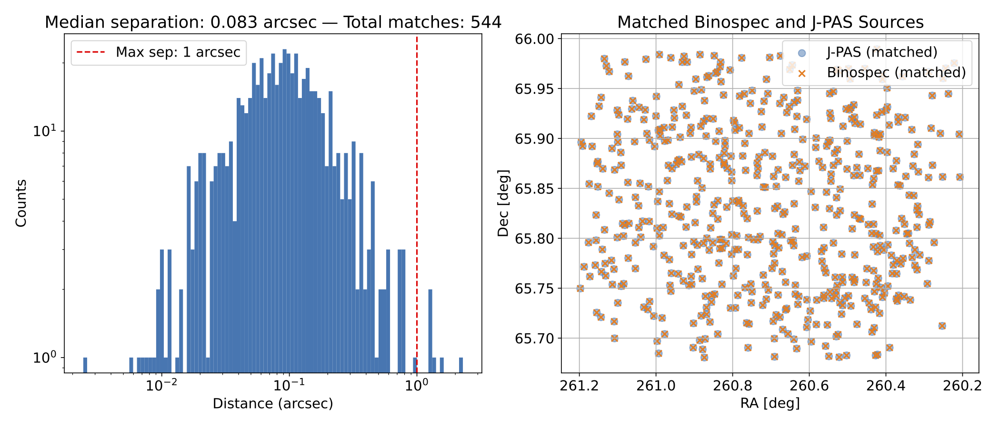

# onexmatch

`onexmatch` is a lightweight Python module for crossmatching two astronomical catalogs based on sky coordinates. It is designed for use in cosmological and survey data analysis workflows, such as matching sources between surveys like [J-PAS](https://www.j-pas.org) and [DESI](https://www.desi.lbl.gov).



---

## Features

- Angular crossmatching using `astropy.coordinates.SkyCoord`
- Match filtering by maximum angular separation
- Duplicate resolution by selecting the nearest match
- Customizable input columns (RA, DEC, ID)
- Outputs matched catalog in CSV format
- Generates diagnostic plots (histogram of separations, sky map)

---

## Installation

Clone the repository and install with:

```bash
git clone https://github.com/valerio-marra/onexmatch.git
cd onexmatch
pip install .
```

**Dependencies**:
- numpy
- pandas
- matplotlib
- astropy

Install them with:

```bash
pip install numpy pandas matplotlib astropy
```

---

## Usage


`my_survey` with `my_labels` is the **catalog** you are working on.
`your_survey` with `your_labels` is the **source** you want to crossmatch against, typically to retrieve additional properties for `my_survey` entries, such as spectroscopic redshifts or classifications.
For each object in the **source**, the closest object in the **catalog** is identified based on sky coordinates.
However, the same **catalog** object may be matched to multiple **source** objects.
In such cases, `onexmatch` retains only the closest **source** match for each **catalog** object.


If `extra_columns` is specified in `my_labels` and/or `your_labels`, the listed columns will be included in the output.  
Columns from `your_labels` are always renamed with the suffix `_{your_label}` to avoid conflicts.  
Columns from `my_labels` are included as-is, without renaming.

Here's a basic usage example using synthetic data. Full example in `example/example.ipynb`.

```python
from onexmatch import onexmatch

matched_df = onexmatch(
    my_labels={
        # Provide either a file path:
        'file': 'cats/J-PAS_synthetic.csv',
        # or directly a pandas DataFrame:
        # 'df': my_df,
        'label': 'J-PAS',
        'id': ['TILE-NUMBER', 'SOURCE-ID'],
        'ra': 'RA',
        'dec': 'DEC',
        'extra_columns': ['z_phot']
    },
    your_labels={
        'file': 'cats/DESI_synthetic.csv',
        # 'df': your_df,
        'label': 'DESI',
        'id': 'TILE-ID',
        'ra': 'RA',
        'dec': 'DEC',
        'extra_columns': ['z_spec', 'CLASS']
    },
    max_sep_arcsec=1.0,
    verbose=True,
    make_plot=True
)
```

This will:

- Match all sources in `your_labels` against `my_labels` within 1.0 arcseconds
- Save a CSV file: `onexmatch_J-PAS_DESI.csv`
- Generate a plot file: `onexmatch_J-PAS_DESI_sep_and_skyplot.pdf` or `.png` (depending on the size of the xmatch)

If file paths are used, outputs are saved in the same directory as `my_labels['file']`.  
If DataFrames are used, outputs are saved in the current working directory.

---

## Output Columns

The resulting DataFrame and CSV include:

- ID columns from the main catalog are kept unchanged
- RA and DEC columns from the main catalog are left unchanged
- ID columns from the source catalog are renamed to `{ID}_{label}`
- RA and DEC columns from the source catalog, renamed as `RA_{label}` and `DEC_{label}`
- Any extra columns listed in `extra_columns` are included in the output as-is
- `separation_arcsec`: the angular separation between matched pairs

---


## License

MIT License

---

## Author

[Valerio Marra](http://marra.cosmo-ufes.org)  
[valerio.marra@me.com](mailto:valerio.marra@me.com)  
Federal University of Espírito Santo (UFES), Brazil
