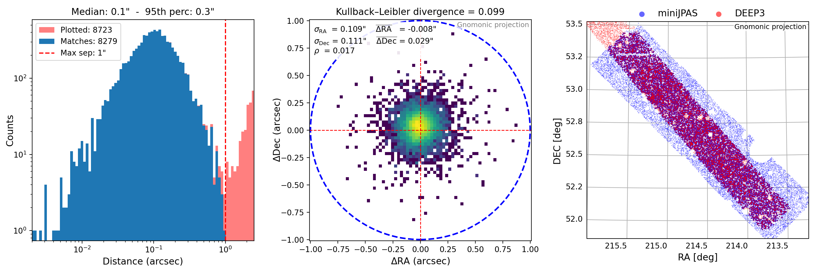

# onexmatch

`onexmatch` is a lightweight Python module for crossmatching two astronomical catalogs based on sky coordinates. It is designed for use in cosmological and survey data analysis workflows, such as matching sources between surveys like [J-PAS](https://www.j-pas.org) and [DESI](https://www.desi.lbl.gov).

Valerio, 15/09/2025



The 2D histogram above displays the distribution of positional offsets in RA (corrected by cos DEC) and DEC. 
The KL divergence is computed, within a radius defined by the 95th percentile of the separation distribution, with respect to a zero-mean isotropic 2D Gaussian having a standard deviation equal to the average of the measured sigmaRA and sigmaDEC.
The histogram below shows the distribution of separations, including the applied matching threshold and the region affected by duplicate associations.


---

## Features

- Angular crossmatching using `astropy.coordinates.SkyCoord`
- Match filtering by maximum angular separation
- Optional ambiguity threshold to flag and remove ambiguous matches
- One-to-one matching: duplicate resolution by keeping the nearest source (symmetric match)
- Customizable input columns (RA, DEC, ID)
- Outputs matched catalog in CSV format
- Generates diagnostic plots (histograms of separations, sky map)

---

## Installation

Clone the repository and install with:

```bash
git clone https://github.com/valerio-marra/onexmatch.git
cd onexmatch
pip install .
```


Install the dependencies with:

```bash
pip install pandas numpy matplotlib astropy cartopy scipy
```

---

## Usage


`my_survey` with `my_labels` is the **catalog** you are working on.
`your_survey` with `your_labels` is the **source** you want to crossmatch against, typically to retrieve additional properties for `my_survey` entries, such as spectroscopic redshifts or classifications.
For each object in the **source**, the closest object in the **catalog** is identified based on sky coordinates.

It is possible for multiple **source** objects to be matched to the same **catalog** object. 
By default, `onexmatch` resolves such duplicates by retaining only the closest source match for each catalog object.


However, if the two closest source objects are nearly equidistant from the same catalog object, this selection may not be reliable. 
To address this, the `ambiguity_arcsec` parameter can be set. When enabled, `onexmatch` detects and removes ambiguous matches according to: `second_closest_sep - first_closest_sep < ambiguity_arcsec`.  
This criterion ensures that matches are discarded if the separation difference between the two closest sources is smaller than `ambiguity_arcsec`, which should be chosen based on the typical PSF and pixel size of `my_survey` or `your_survey`.


If `extra_columns` is specified in `my_labels` and/or `your_labels`, the listed columns will be included in the output. 
Columns from `your_labels` are always renamed with the suffix `_{your_label}` to avoid conflicts. 
Columns from `my_labels` are included as-is, without renaming.

Here's a basic usage example using synthetic data. Full example in `example/example.ipynb`.

```python
from onexmatch import onexmatch

matched_df = onexmatch(
    my_labels={
        'file': 'jnep.csv',
        # or directly a pandas DataFrame:
        # 'df': my_df,
        'label': 'J-NEP',
        'id': ['TILE_ID', 'NUMBER'],
        'ra': 'RA',
        'dec': 'DEC',
        'extra_columns': ['MAG_AUTO_56', 'sglc_prob_star']
    },
    your_labels={
        'file': 'MoonObs.csv',
        # 'df': your_df,
        'label': 'MoonObs',
        'id': 'OBJID', # optional
        'ra': 'RA',
        'dec': 'DEC',
        'extra_columns': ['Z']
    },
    max_sep_arcsec=1.0,
    ambiguity_arcsec=0.5,
    verbose=True,
    make_plot=True,
    show_duplicates=True
)
```

This will:

- Match all sources in `your_labels` against `my_labels` within 1.0 arcseconds
- Remove ambiguous matches with a scale < 0.5 arcsec
- Save a CSV file: `onexmatch_J-NEP_MoonObs.csv`
- Generate plot files:
  - `onexmatch_J-NEP_MoonObs_duplicates.pdf`
  - `onexmatch_J-NEP_MoonObs_sep_and_skyplot.png` (and `.pdf` depending on the size)

If file paths are used, outputs are saved in the same directory as `my_labels['file']`.  
If DataFrames are used, outputs are saved in the current working directory.


---

## Output Columns

The resulting DataFrame and CSV include:

- ID, RA and DEC columns from the main catalog are kept unchanged
- ID (optional), RA and DEC columns from the source catalog are renamed with the suffix `_{label}`
- Any extra columns listed in `extra_columns` are included in the output as-is
- `separation_arcsec`: the angular separation between matched pairs

---


## License

MIT License

---

## Author

[Valerio Marra](http://marra.cosmo-ufes.org)  
[valerio.marra@me.com](mailto:valerio.marra@me.com)  
Federal University of Espírito Santo (UFES), Brazil
